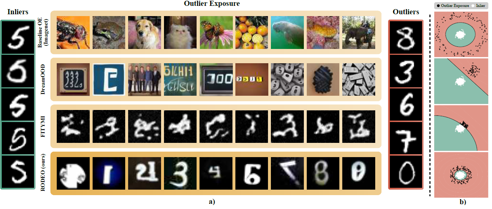

In recent years, there have been significant improvements in various forms of image outlier detection. However, outlier detection performance under adversarial settings lags far behind that in standard settings. This is due to the lack of effective exposure to adversarial scenarios during training, especially on unseen outliers, leading detection models failing to learn robust features. To bridge this gap, we introduce RODEO, a data-centric approach that generates effective outliers for robust outlier detection. More specifically, we show that incorporating outlier exposure (OE) and adversarial training could be an effective strategy for this purpose, as long as the exposed training outliers meet certain characteristics, including diversity, and both conceptual differentiability and analogy to the inlier samples. We leverage a text-to-image model to achieve this goal. We demonstrate both quantitatively and qualitatively that our adaptive OE method effectively generates ''diverse'' and ''near-distribution'' outliers, leveraging information from both text and image domains. Moreover, our experimental results show that utilizing our synthesized outliers significantly enhances the performance of the outlier detector, particularly in adversarial settings.